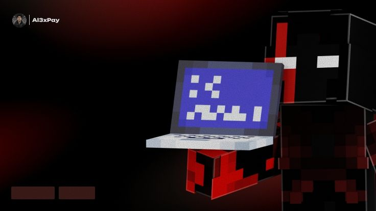

### Алексей Царегородев 

Занимаюсь написанием плагинов Minecraft,  также переписанием уже написанных популярных плагинов 

**В настоящий момент:** Занимаюсь созданием проекта WillSlow

**Недавняя работа**
- StarsBackPacks помогает сохранять ресурсы без ставки шалкера,с помощью данного плагина можно открывать шалкер в руке или подбирать ресурсы через Shift.

- StarsSymbol Выводит указанный символ из конфига через Placeholder с разными цветами или радужным цветом в Tab.

- StarsMythicBoss спавнит босса из конфига через сторонний плагин MyhicBoss и после смерти выводит статистику по урону выдвая за это награды и выбрасывая некоторые из них на хемлю.

- StarsItems добавляет кастомные предметы,зачарования.

- StarsQuest добавляет систему ежедневных квестов с магазином за коины из выполненных квестов.

**Stack:** Java · Python

[Portfolio](https://Al3xPay.github.io/Al3xPay)· [Email](mailto:Al3xPayment@gmail.com) · [Telegram](https://t.me/Al3xPay)

> Open to senior backend, infrastructure, and tech lead roles. Remote or relocation.